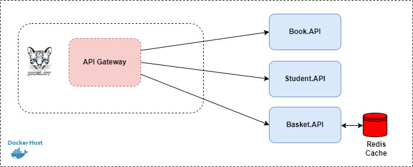

# API Gateway - Redis Cache (Backend)

A small simple api gateway with cache redis .net core


## Implemented:

- ASP.NET Core 6.0
- Gateway pattern (Ocelot)
- Swagger
- Redis Cache
- Docker Compose

## Docker Compose Usage

```
docker-compose build
```

```
docker-compose up
```

## Features available for access:
- Books:
    - Get All Books
        - Url: https://localhost:4001/api/v1/books
        - Url from gateway: https://localhost:5101/book-api/v1/books

- Students:
    - Get All Students
        - Url: https://localhost:3001/api/v1/students
        - Url from gateway: https://localhost:5101/student-api/v1/students

- Basket:
    - Add Basket
        - Url: https://localhost:6001/api/v1/basket
        - Url from gateway: https://localhost:5101/basket-api/v1/basket

        - Example Body:
        ```
        {
            "bookId": "1673a9fd-191a-479c-a41f-3dc5611aa98e",
            "studentId": "3673a9fd-191a-479c-a41f-3dc5611aa77d"
        }
        ```
    - Get Basket By Student Id
        - Url: https://localhost:6001/api/v1/basket/student/{studentId}
        - Url from gateway: https://localhost:5101/basket-api/v1/basket/student/{stuentId}

Note: You can download the postman file configuration to import. The file is located in the Postman files folder
